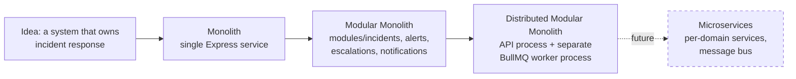
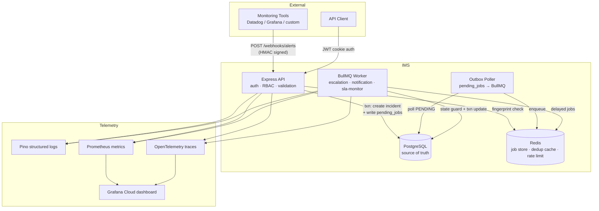
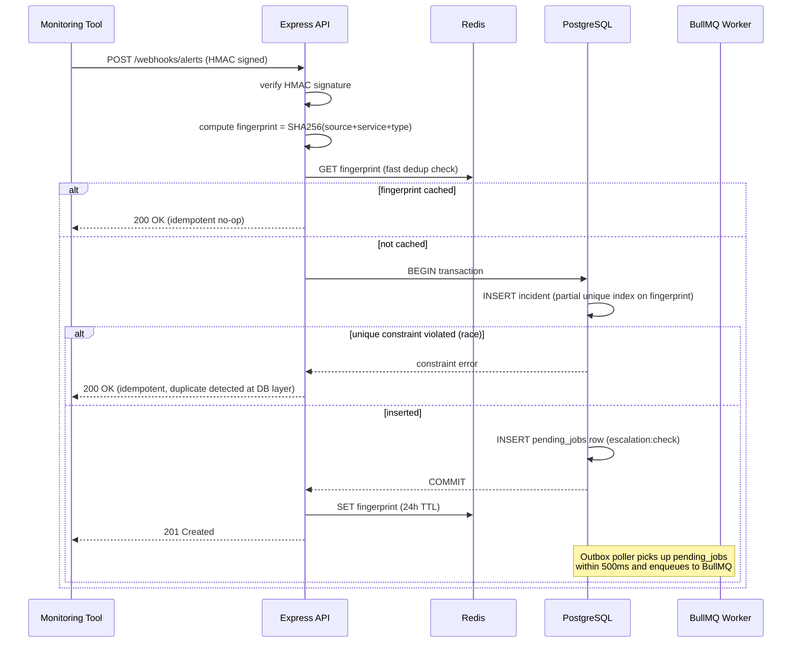
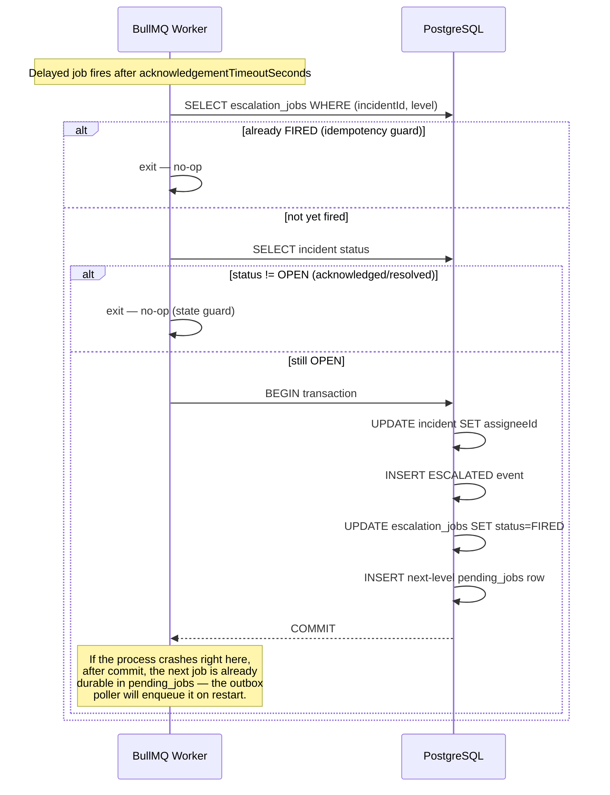

# Incident Management System — Engineering Case Study

**Project:** Incident Management System (IMS)
**Author:** Abhishek Kumar
**Stack:** Node.js · Express · TypeScript · PostgreSQL · Prisma · Redis · BullMQ · Docker
**Status:** In active development (45–60 day build)
**Links:** [GitHub](https://github.com/DevWithAbhishek) · [Portfolio](https://codewithabhishek.in)

---

> This document is the engineering retrospective behind IMS. The [README](./README.md) tells you what the system does. This tells you why it was built this way, what alternatives were rejected and why, what broke during development, and what a senior engineer should look for when evaluating it. If you only read one document in this repository before an interview, read this one.

---

## Table of Contents

1. [Executive Summary](#1-executive-summary)
2. [Problem Statement](#2-problem-statement)
3. [Project Vision](#3-project-vision)
4. [Functional Scope](#4-functional-scope)
5. [Architecture Evolution](#5-architecture-evolution)
6. [Major Architecture Decisions](#6-major-architecture-decisions)
7. [System Architecture](#7-system-architecture)
8. [Production Challenges Solved](#8-production-challenges-solved)
9. [Reliability Strategy](#9-reliability-strategy)
10. [Security Strategy](#10-security-strategy)
11. [Performance Strategy](#11-performance-strategy)
12. [Engineering Decisions I'm Proud Of](#12-engineering-decisions-im-proud-of)
13. [Mistakes & Lessons Learned](#13-mistakes--lessons-learned)
14. [Scaling Roadmap](#14-scaling-roadmap)
15. [Testing Strategy](#15-testing-strategy)
16. [DevOps Strategy](#16-devops-strategy)
17. [AI in Development](#17-ai-in-development)
18. [Interview Readiness](#18-interview-readiness)
19. [Key Takeaways](#19-key-takeaways)
20. [Final Reflection](#20-final-reflection)

---

## 1. Executive Summary

The Incident Management System is a backend-focused project that models the operational backbone every software company needs but rarely builds well: a system that detects when something breaks, routes the alert to the right person, enforces a time-bound response, and records everything for accountability and learning.

It is deliberately not a frontend showcase. It is an exercise in the backend engineering problems that separate junior from senior engineers — idempotent event ingestion under concurrent delivery, distributed state machines with database-enforced invariants, time-based escalation that must remain correct under worker failure, async notification pipelines with retry and dead-letter handling, and SLA enforcement with audit-quality record-keeping.

**Business problem:** Companies detect failures with monitoring tools (Datadog, Grafana, custom heartbeats) but have no structured layer between "an alert fired" and "the right human acknowledged it, owns it, and resolved it inside an agreed time window." Below a certain company size, this gap is filled by a Slack channel, a spreadsheet, and tribal knowledge — which works until the night it doesn't.

**Technical goals:** Build the response layer that sits downstream of monitoring tools — idempotent ingestion, automatic on-call assignment, a database-enforced incident lifecycle, self-escalating notification chains, SLA tracking with pre-breach warnings, and an immutable audit trail suitable for postmortems.

**Engineering goals:** Demonstrate production backend judgment using the smallest stack that can correctly express the problem — PostgreSQL and BullMQ rather than Kafka and Kubernetes — and be able to explain, from direct implementation and debugging experience, every non-obvious decision under interview pressure.

**Target users (of the engineering narrative):** Startup CTOs and engineering managers screening backend candidates, senior backend engineers doing technical due diligence, recruiters scanning for depth signals, and other engineers deciding whether the patterns here are worth borrowing.

**Why this project matters in 2026:** Code generation is now cheap. What AI tooling does not provide is judgment about failure modes — knowing that a webhook will be retried, that a worker will crash mid-job, that two requests will race on the same row. Those are the problems IMS was built to solve correctly, by hand, on purpose.

---

## 2. Problem Statement

Software systems fail. Databases crash, payment gateways return errors, authentication services time out. This is not an exception case — it is the default condition of any system operating at scale. The question is never whether failures will happen. The question is what happens in the minutes between the failure and the fix.

### The five failure modes IMS targets directly

**Alert fatigue.** Monitoring tools fire. They do not deduplicate well, and a flapping check or a retrying webhook can produce the same alert five times in ten seconds. Without deduplication at the point of ingestion, each duplicate becomes a duplicate incident — and responders learn to ignore a noisy system, which is the precise failure mode that causes a real P0 to be missed.

**Missing observability of the response itself.** Datadog and Grafana are excellent at detecting that something is wrong. They have no concept of who is on-call tonight, whether anyone has seen the alert, or how long it has been unacknowledged. They are the detection layer. IMS is explicitly the layer immediately downstream — the layer that owns the human response, not the signal.

**Slow incident response.** A P0 that lands in an unmonitored channel at 2:47 AM and is acknowledged at 3:27 AM has cost forty minutes that a structured escalation chain would not have allowed. Industry data consistently shows that teams with structured incident management resolve incidents several times faster than teams coordinating ad hoc over chat.

**Lack of ownership and escalation.** "Someone will see it" is not an assignment. Without an explicit on-call schedule resolved against the current time, and an escalation chain that fires automatically when the assigned engineer does not respond, ownership is a hope, not a guarantee.

**Poor postmortems.** When the only history of an incident lives in people's memory and scattered Slack threads, the postmortem is reconstructed badly and inconsistently. An append-only, queryable event log turns "what happened, in order" from a reconstruction exercise into a database query.

### Connecting this to real production systems

For a B2B SaaS company, reliability is not a feature — it is a legal commitment. Uptime SLAs are written into enterprise contracts. A 45-minute payment outage does not cost only the revenue lost during the outage; it costs the engineering time to reconcile half-written transactions, the support overhead of managing upset clients, and potentially a contractual penalty. For investors and boards, incident data — MTTR trends, escalation rates, SLA breach percentages over time — is a signal of operational maturity: a company managing its reliability, not just experiencing it.

IMS answers four questions that no single tool in most early-stage stacks answers well together:

1. Who needs to know about this, right now?
2. Who is responsible for fixing it, right now?
3. Has it been acknowledged within the required time window?
4. Was it resolved within the contractual or internal SLA?

### Existing solutions and their gaps

| Tool | Gap |
|---|---|
| **PagerDuty** | Excellent product, priced at $21–34/user/month — $12k–$20k/year for a 40-engineer team just to receive pages. Configuration expertise gap between "we bought it" and "it's configured correctly" is large. |
| **OpsGenie** | More accessible pricing post-Atlassian acquisition, but on-call schedule management is unintuitive and alert deduplication is largely manual. |
| **Slack + spreadsheet** | The honest default at small scale. No escalation, no SLA tracking, no audit trail, no pattern recognition. Breaks catastrophically once volume grows. |
| **Jira Service Desk** | Built for planned work and support tickets. Creating a ticket is not a reasonable first action when payments are down and an engineer needs to be reached in under five minutes. |
| **Grafana / Datadog alerting** | Fires alerts but has no concept of acknowledgement, on-call identity, or escalation. Detection, not response. |

Building IMS instead of adopting one of these is a learning decision, not a business one. State machines, idempotency, time-aware distributed state, async job queues with retry logic, and SLA enforcement are among the most frequently tested concepts in backend interviews — and the only way to answer them from experience is to have built and debugged the thing yourself.

---

## 3. Project Vision

IMS is built to demonstrate a specific kind of engineering mindset, not a specific feature list. Every design choice maps back to one of the following:

- **Production ownership** — the system is designed assuming it will be operated, not just demoed. There is a debugging journal, runbooks for the failure modes that were actually hit, and a deployment story with a live URL.
- **Reliability over cleverness** — the escalation engine, the notification pipeline, and the audit log are all built around the assumption that workers crash, networks partition, and webhooks retry. Correctness under those conditions was the design target from day one, not a patch applied after a bug report.
- **Observability as a first-class concern** — structured logs with correlation IDs, Prometheus metrics with meaningful labels, and OpenTelemetry traces exist because "how would I know if this were failing right now?" is a question asked before shipping, not after an outage.
- **Deliberate, bounded scope** — every "do not build this" decision (Kafka, Kubernetes, multi-tenancy, a WebSocket dashboard) was made explicitly and is documented with the reasoning, not silently skipped.
- **Engineering judgment over technology breadth** — the project optimizes for being able to explain every decision under interview pressure, which rules out adding a technology whose only purpose is to appear on a resume.

The project's own internal rule states this directly: before building any feature, the question asked is *"Can I explain the hardest design decision in this feature, from direct implementation experience, under interview pressure, in 90 seconds?"* If the answer is no — because AI built it, because it was copy-pasted, or because it was too trivial to require a decision — it does not count as a feature. This single constraint shapes the entire functional scope below.

---

## 4. Functional Scope

### Must Have

These six capabilities are the ones the project considers non-negotiable, because together they cover the entire interview-relevant concept set: idempotency, state machines, distributed timing, at-least-once delivery, the transactional outbox pattern, append-only design, and time-based scheduling.

| Capability | What it does |
|---|---|
| Idempotent webhook alert ingestion | Two-layer deduplication (Redis TTL cache + PostgreSQL partial unique index) so a retrying monitoring tool never creates duplicate incidents |
| Five-state incident FSM | `OPEN → ACKNOWLEDGED → MITIGATING → RESOLVED`, with terminal-state protection and conditional-UPDATE concurrency safety |
| Self-scheduling escalation chain | BullMQ delayed jobs that re-schedule themselves through an escalation policy, backed by a transactional outbox so a worker crash cannot orphan the chain |
| Async notification pipeline | Email + Slack channels, exponential backoff, fallback routing, dead-letter status on exhaustion |
| Append-only audit log | `incident_events`, enforced as INSERT/SELECT-only at the PostgreSQL role layer — not just by application convention |
| SLA tracking with pre-breach warning | Snapshot SLA targets at creation, an 80%-elapsed warning job, write-once breach status at resolution |

**Why this category exists:** these are the features that cannot be removed without removing the project's entire interview value. Each one maps to a real production failure mode and a real, commonly-asked backend interview question.

### Nice to Have

Built only after the must-have set and its documentation are complete.

| Capability | Why it's valuable | Why it's not essential |
|---|---|---|
| Postmortem workflow (DRAFT → IN_REVIEW → PUBLISHED) | A second nested FSM, and a real consumer of the timeline data | The value lives in the underlying audit log, which already exists; the postmortem is a UI wrapper around data already produced |
| MTTR / SLA compliance reporting (`PERCENTILE_CONT` queries) | Demonstrates PostgreSQL window functions and produces data a CTO would actually use | The data exists the moment SLA tracking ships; the endpoints are SQL over data already being written |
| AI severity classification on ingestion | The 2026-relevant story: AI as enrichment, never as the routing decision-maker | It is one BullMQ job calling one API — the architectural placement is the interesting part, not the code |
| Cursor-based pagination on the incident list | Correct, defensible answer to "why not offset pagination" | The list endpoint works without it; the value is in being able to explain the choice |

**Why this category exists:** these features add real interview value but no new conceptual depth beyond what the must-have set already teaches. They are valuable additions, not architectural pillars.

### Future Enhancements (explicitly out of scope for v1)

| Idea | Why it's deferred |
|---|---|
| Kafka for alert ingestion | Cannot be explained in depth without having operated it at the scale that justifies it; the webhook + idempotent-dedup solution is simpler, correct, and fully explainable at IMS's actual traffic |
| Kubernetes | Railway/Docker Compose handles orchestration at this scale; a CTO hiring a backend engineer is evaluating production ownership, not cluster operations |
| Real-time WebSocket dashboard | Adds frontend scope with zero new backend concepts; polling is functionally equivalent for this use case |
| SMS via Twilio | SDK configuration, not an engineering decision; the retry/fallback/dead-letter story is already fully told by email + Slack |
| Redis Cluster / Sentinel | Not warranted at this scale; claiming it without having configured it is a false signal in an interview |
| Multi-tenancy | A separate architectural project in its own right, not an incremental add |
| Service dependency graph | A real and interesting problem, but one that risks scope creep that does not ship inside the build window |
| AI-generated postmortems | One LLM call with no engineering depth; the AI story IMS tells is about *placement*, and a postmortem generator does not add to that story |

**Why this category exists:** naming what was deliberately *not* built, and why, is itself a signal. A list of explicit exclusions with reasoning is harder to produce than a list of features, and it is the difference between "this person ran out of time" and "this person scoped deliberately."

---

## 5. Architecture Evolution



**Idea → Monolith.** The first working version is a single Express/TypeScript service: routes, a Prisma client, a Postgres database. This is intentional, not a placeholder embarrassment — at one engineer and a five-week build window, a monolith is the only architecture that lets every decision get made and explained with full context.

**Monolith → Modular Monolith.** As the incident, alert, escalation, and notification domains grow, the codebase is organized into `src/modules/{incidents,alerts,escalations,notifications,postmortems,oncall,auth,users}/`, each with its own routes, service layer, and types. Nothing is physically separated yet, but the seams are real: a module's internals are not reached into directly by another module's business logic.

**Modular Monolith → Distributed Modular Monolith.** The single meaningful infrastructure split in this project is between the **API process** and the **BullMQ worker process**. They share the same codebase and the same Prisma schema, but they are different Docker containers, different OS processes, and they fail independently — a crashed worker does not take the API down, and the worker can be scaled separately from the API. This is the architecturally correct minimum amount of distribution: it teaches process separation, queue-based decoupling, and independent scaling without paying for a network call between services that don't need one.

**Why microservices were intentionally postponed.** The case for microservices is strongest when different parts of a system have genuinely different scaling profiles, are owned by different teams, or need independent deploy cadences. None of those conditions hold for IMS at its current scale or team size of one. Splitting `incidents` and `notifications` into separate services today would add network calls, distributed tracing complexity, and operational surface area — in exchange for an architecture diagram that looks impressive and is not defensible under questioning. The honest answer to "why not microservices" is the answer a CTO wants to hear: *the business and traffic profile does not yet justify the operational cost, and the modular monolith's seams are already where the service boundaries would go if and when it does.*

---

## 6. Major Architecture Decisions

Full ADRs live in `docs/adrs/`. The summaries below are the condensed, interview-ready version of each.

### ADR — Monolith (with a separate worker process) vs. Microservices

**Problem:** How much architectural distribution does a backend that needs async escalation jobs actually need?
**Decision:** Modular monolith for the domain logic; a physically separate BullMQ worker process for async execution.
**Alternatives:** Full microservices per domain (incidents, notifications, escalations as separate deployed services).
**Trade-off:** Microservices would demonstrate distributed-systems tooling breadth but at the cost of network calls and operational complexity this project's scale does not need — and at the cost of being able to fully defend the design under questioning.
**Why this decision:** The project optimizes for defensibility over the appearance of scale. The worker/API split is the one distribution boundary that is actually justified by a real difference in failure and scaling characteristics.

### ADR — PostgreSQL vs. MongoDB

**Problem:** Where does the data layer enforce correctness — state machine transitions, exactly-once incident creation, write-once SLA breach status, append-only audit logs?
**Decision:** PostgreSQL as the single source of truth.
**Alternatives:** MongoDB (flexible schema, easy prototyping), MySQL, SQLite.
**Trade-off:** PostgreSQL is operationally heavier and requires migrations for every schema change; in exchange it provides ACID transactions, partial unique indexes, CHECK constraints, row-level permissions, and native window functions — every one of which is load-bearing in this system.
**Why this decision:** No document database provides these guarantees natively, and they are not optional in a system where a corrupted state machine means a missed escalation. MongoDB's aggregation pipeline is also materially more complex than SQL for the `PERCENTILE_CONT` and `date_trunc` reporting queries IMS needs.

### ADR — Redis + BullMQ for the async layer

**Problem:** Escalation timers need delayed execution, retry with backoff, dead-letter handling, and job cancellation by ID.
**Decision:** Redis-backed BullMQ.
**Alternatives:** pg-boss (PostgreSQL-backed, removes the Redis dependency, but polling-based with second-level delay precision and no native cancellation), Agenda (MongoDB-backed — mismatched persistence layer), bee-queue (no delayed-job support, a hard requirement here).
**Trade-off:** Redis becomes a single point of failure for the entire async layer — if Redis is down, no new escalation or SLA jobs can fire. This is treated as the single most severe failure mode in the system and is explicitly documented, not hidden.
**Why this decision:** Delayed job precision (via Redis sorted sets), the job cancellation API (needed to cancel an escalation timer the instant an incident is acknowledged), and native retry/backoff are not generic conveniences here — they are the exact primitives the escalation engine is built on. pg-boss remains the documented, credible alternative if the Redis single-point-of-failure becomes unacceptable.

### ADR — Docker & Docker Compose for environment parity

**Problem:** Three services (Node, Postgres, Redis) must run identically on every machine, including an interviewer's.
**Decision:** `docker-compose.yml` with `app`, `worker`, `postgres`, `redis`, and a one-shot `migrate` service.
**Alternatives:** Manual local setup instructions; no orchestration.
**Trade-off:** Docker Desktop overhead and cold container start time, in exchange for `docker compose up` being the entire setup story.
**Why this decision:** A project that requires manual environment setup is a project that does not get evaluated. The separate `migrate` service (rather than running migrations inside the `app` container's startup command) also avoids the real failure mode where two app containers starting simultaneously in a rolling deploy both attempt the same migration.

### ADR — GitHub Actions CI/CD

**Problem:** Lint, type-check, and test must run automatically before code reaches `main`, and the deploy step should not depend on a human remembering to run it.
**Decision:** GitHub Actions pipeline: install → lint → type-check → unit tests → integration tests → deploy on merge to `main`.
**Alternatives:** No CI; manual pre-push checklist.
**Trade-off:** Pipeline setup and maintenance cost, in exchange for a CI badge that is itself a credibility signal and a safety net the project's own debugging journal repeatedly needed.
**Why this decision:** A green CI badge on a portfolio repository is one of the cheapest, highest-signal things a candidate can show — it proves the tests actually run somewhere other than the author's laptop.

### ADR — Authentication: HttpOnly cookies + JWT with token family rotation

**Problem:** Stateless auth that survives page refreshes, resists XSS token theft, and can detect refresh-token reuse (theft) rather than just rotating blindly.
**Decision:** Access JWT (15 min) and refresh JWT (7 day) in `HttpOnly; Secure` cookies; refresh tokens tracked in families, with reuse of an already-rotated token triggering full-family revocation.
**Alternatives:** `localStorage` + `Authorization` header (XSS-vulnerable); simple rotation without family tracking (cannot distinguish a legitimate double-submit race from theft); server-stored sessions (a DB read on every request, adding latency and pool pressure across the project's growing endpoint count).
**Trade-off:** HttpOnly cookies require CSRF mitigation, since the browser attaches them automatically even to cross-site requests.
**Why this decision:** Token family rotation closes the specific blind spot in naive rotation — if an attacker uses a stolen refresh token first, simple rotation just silently logs the real user out and the attacker continues unnoticed. Family tracking detects the reuse, revokes every session in the family, and gives the operator a clear signal that theft occurred.

### ADR — Event-driven async patterns: transactional outbox over direct enqueue

**Problem:** A direct `enqueue()` call to BullMQ immediately after a database commit is not atomic with that commit. A crash between the two leaves an incident with no escalation job, ever.
**Decision:** Write the job description to a `pending_jobs` table inside the same Postgres transaction as the state change; a separate poller (500ms interval) reads `PENDING` rows, enqueues them into BullMQ, and marks them `ENQUEUED`.
**Alternatives:** Direct enqueue (simpler, but not crash-safe); a message broker with transactional semantics (added infrastructure with no corresponding need at this scale).
**Trade-off:** An extra table, an extra poller process, and a small amount of enqueue latency (bounded by the poll interval), in exchange for a guarantee that a committed state change always eventually produces its corresponding job — even across a process crash.
**Why this decision:** This is the single pattern in the system that most directly distinguishes "I know what at-least-once delivery means" from "I have debugged what happens when at-least-once delivery fails." It is asked about, by name, in senior backend interviews.

---

## 7. System Architecture

### Components

- **API layer (Express + TypeScript):** ~40+ REST endpoints across auth, incidents, alerts, on-call, escalation policies, postmortems, and reporting. Owns HTTP routing, middleware (auth, RBAC, validation, error shaping), and request lifecycle. Deliberately built on Express rather than NestJS so the middleware chain stays explicit and explainable rather than hidden behind a framework's DI container.
- **Worker process (BullMQ):** A separate container/process from the API, registering processors for three named queues — `escalation`, `notification`, and `sla-monitor`. A crashed worker does not take down the API; the worker scales independently.
- **Outbox poller:** A lightweight background loop (500ms interval) that promotes rows from `pending_jobs` into real BullMQ jobs — the mechanism that makes the transactional outbox pattern work.
- **PostgreSQL (via Prisma):** Source of truth for all persistent state — users, services, escalation policies/levels, on-call schedules, incidents, incident events, escalation job records, notification deliveries, postmortems. Owns every correctness-critical invariant: partial unique indexes, CHECK constraints, row-level permissions, ACID transactions.
- **Redis:** Backs BullMQ's delayed-job sorted sets, the alert fingerprint dedup cache (24h TTL), and the rate limiter's atomic counters. Nothing in Redis is a source of truth — Postgres is, always.
- **Telemetry (Pino + Prometheus + OpenTelemetry + Grafana Cloud):** Structured logs with correlation IDs, counters and histograms for incident/escalation/notification/SLA events, and traces spanning webhook ingestion through job execution.
- **Docker:** Local parity and multi-service orchestration; `app`, `worker`, `postgres`, `redis`, and `migrate` as named Compose services.

### Component diagram



### Sequence diagram — alert ingestion to incident creation



### Sequence diagram — escalation chain with crash recovery



### Request flow — incident acknowledgement (concurrency-safe)

```
PATCH /incidents/:id/acknowledge
  → JWT auth middleware
  → RBAC: requireOwnership() — only the assignee may acknowledge
  → Conditional UPDATE: WHERE id = :id AND status = 'OPEN'
      0 rows affected → 409 Conflict (someone else already acknowledged)
      1 row affected  → 200 OK, ACKNOWLEDGED event inserted,
                         pending escalation job cancelled via Job.remove()
```

---

## 8. Production Challenges Solved

### Race conditions — concurrent acknowledgement

**Why it matters:** Two responders pressing "acknowledge" within milliseconds of each other is not a hypothetical — it happens whenever a team is paged together. A naive read-then-write implementation lets both requests pass the state check before either commits, producing a duplicate `ACKNOWLEDGED` event and an overwritten timestamp.
**How IMS solves it:** A single conditional `UPDATE incidents SET status = 'ACKNOWLEDGED', acknowledged_at = NOW() WHERE id = $1 AND status = 'OPEN' RETURNING *`. Zero rows returned means another request already won; the loser receives `409 Conflict` with no event inserted. This is optimistic concurrency control with the database itself as the arbiter — no application-level lock, no cross-table transaction required for the check.
**Trade-off:** The losing request gets a 409 instead of a 200, which the client must handle explicitly as "someone else got there first," not as an error to retry.

### Idempotency — duplicate alert ingestion

**Why it matters:** Monitoring tools retry on timeout. A flapping check can fire the same logical alert several times within seconds. Without deduplication, each duplicate becomes a duplicate incident.
**How IMS solves it:** Two layers. A deterministic fingerprint (`SHA-256(source + service_slug + alert_type)`) is checked against a Redis TTL cache first — fast, but not the correctness guarantee. The actual guarantee is a PostgreSQL **partial unique index** (`UNIQUE (alert_fingerprint) WHERE alert_fingerprint IS NOT NULL`), so even if two requests race past the Redis check simultaneously, only one `INSERT` can succeed; the second receives a constraint violation that the application translates into an idempotent `200 OK`.
**Trade-off:** Two layers means two places to reason about correctness — but the failure mode if Redis is down (cache miss, fall through to Postgres) degrades to "slower, still correct," which is the right trade to make.

### Row locking & transactions

**Why it matters:** Several operations — incident creation, escalation, resolution — must update multiple rows (or a row plus an event insert) as a single atomic unit, or a crash mid-operation leaves inconsistent state.
**How IMS solves it:** Prisma's `$transaction` wraps every multi-write operation: e.g., updating the assignee, inserting the `ESCALATED` event, marking the current escalation level `FIRED`, and writing the next level into `pending_jobs` all commit together or not at all.
**Trade-off:** Transactions add a small amount of latency and require care about transaction scope — too broad, and you hold locks longer than necessary; too narrow, and you lose the atomicity guarantee you needed.

### Retry logic & dead letter queue

**Why it matters:** A notification that fails silently is operationally equivalent to having sent no notification at all. The responder must be reached regardless of which channel is having a bad night.
**How IMS solves it:** BullMQ's `attempts: 5, backoff: { type: 'exponential', delay: 1000 }` on the notification queue. A retryable failure (e.g., a transient SMTP error) retries with backoff; a non-retryable failure (e.g., a malformed email address) skips immediately to the fallback channel. Once every channel is exhausted, the delivery is marked `DEAD_LETTERED` and a `NOTIFICATION_FAILED` event is written to the incident's audit log — visible, not silent.
**Trade-off:** `removeOnFail: false` is set deliberately so failed jobs remain inspectable in BullMQ rather than vanishing, at the cost of needing a cleanup policy for old failed jobs over time.

### Queue failures & worker crash recovery

**Why it matters:** At-least-once delivery means a job can run more than once, and a worker can die between two operations that both needed to happen.
**How IMS solves it:** The transactional outbox pattern (see ADR above) makes the "DB commit happened but the job was never enqueued" failure mode impossible — the job description is durable in Postgres the moment the state change commits, and an independent poller is responsible for getting it into BullMQ. Every worker additionally re-checks its own idempotency key and the current incident state before taking any action, so a job that runs twice (at-least-once delivery's defining property) produces the same result as running once.
**Trade-off:** The poller adds up to 500ms of enqueue latency and is itself a process that needs to be running and monitored — it is a new moving part introduced specifically to remove a worse failure mode.

### Duplicate alerts — see Idempotency above.

### Escalation chains under failure

**Why it matters:** An escalation chain that silently stops because a worker crashed mid-execution is worse than no escalation chain — it creates false confidence that someone will be notified.
**How IMS solves it:** Each escalation level's job carries an idempotency key checked against the `escalation_jobs` table before any side effect runs, plus a state guard that re-reads the incident's current status before escalating — so a job that fires late (after the incident was already acknowledged) is a safe no-op rather than an unwanted reassignment. Cancellation on acknowledgement calls `Job.remove()`; if that throws "not found" because the job already fired in the gap between the check and the cancellation, the worker's own state guard is the second line of defense.
**Trade-off:** This requires writing every guard by hand and testing the crash-mid-execution path explicitly (kill the worker process after the DB commit, before the outbox write resolves, then verify the chain resumes on restart) — there is no framework that gives this correctness for free.

### Authentication & rate limiting

**Why it matters:** Sessions must survive refreshes without being readable by injected JavaScript, and a public webhook endpoint needs protection against alert storms.
**How IMS solves it:** HttpOnly cookie-based JWTs with refresh token family rotation (see ADR above); rate limiting on the webhook ingestion endpoint via Redis `INCR` + `EXPIRE` (fixed window) — chosen to fail open during a Redis outage rather than block all alert ingestion.
**Trade-off:** Rate limiting failing open is a deliberate choice to prioritize availability of the detection pipeline over strict throttling during a Redis outage — documented, not accidental.

### Caching

**Why it matters:** Not every read needs to hit Postgres, and the fingerprint dedup check specifically benefits from sub-millisecond lookups.
**How IMS solves it:** Redis is used exclusively as a performance and ephemeral-state layer (job store, dedup cache, rate limiter), never as a source of truth. If Redis is flushed or restarted, nothing is lost that Postgres cannot reconstruct or that simply degrades gracefully (slower dedup, rate limiting open).
**Trade-off:** This rules out using Redis for anything that must survive a restart with full durability — by design.

### Monitoring

**Why it matters:** "Is the escalation engine healthy" needs to be answerable with data, not a guess.
**How IMS solves it:** Prometheus counters labelled meaningfully (`escalation_jobs_fired_total{level}`, `sla_breach_total{severity}`) rather than generic (`http_requests_total` alone), feeding a Grafana Cloud dashboard. See [Section 9](#9-reliability-strategy) for the full strategy.

---

## 9. Reliability Strategy

**Logging.** Pino structured logs with a correlation/request ID middleware attached to every request and propagated through to async job execution. Fields are structured (`incidentId`, `userId`, `escalationLevel`, `eventType`), log levels are disciplined (`info` for normal operations, `warn` for recoverable errors, `error` for failures requiring attention), and PII/secrets are explicitly excluded from log output.

**Metrics.** Prometheus via `prom-client`: `incidents_created_total` (by severity and source), `escalation_jobs_fired_total` (by level), `notification_delivery_duration_ms` (histogram, by channel), `sla_breach_total` (by severity), and `http_request_duration_ms`. The deliberate choice was a small number of *useful* metrics over a large number of *present* metrics — a labelled, specific counter answers a real operational question; an unlabelled generic one does not.

**Traces.** OpenTelemetry spans following a request from webhook ingestion through incident creation to job enqueue, with span attributes including the fingerprint hash, incident ID, and severity — so a trace can be followed across the HTTP boundary into the async job system, not just within a single request.

**Dashboards & alerting.** Grafana Cloud (free tier) hosts a dashboard tracking incident creation rate by severity, escalation rate over time, notification delivery success/failure ratio, and SLA breach rate. A screenshot of the running dashboard lives in the README as verifiable evidence — an unverifiable observability claim is treated as more damaging than no claim at all.

**Health checks.** `GET /health` returns the live ping status of both PostgreSQL and Redis, not just a static `200 OK` — distinguishing "the process is running" from "the process can actually do its job."

**Error handling.** A global Express error handler shapes every error response consistently; no raw stack traces ever reach a client. Input is validated with Zod at the API boundary before it reaches any business logic.

**Retry strategy.** Exponential backoff (`attempts: 5, base: 1000ms`) for notification delivery; immediate fallback-channel routing for non-retryable failures (e.g., a malformed address) rather than wasting retry attempts on an error that will never succeed.

**Fail-open vs. fail-closed.** Deliberately mixed, by component, based on consequence: the rate limiter **fails open** (an outage of Redis should not block incoming alerts — missing a real incident is worse than a brief lapse in throttling). The fingerprint dedup cache **fails open to the database** (a Redis miss falls through to the Postgres unique constraint, which is slower but still correct). The audit log's append-only guarantee **fails closed** at the database role layer — there is no code path, intentional or buggy, that can succeed in mutating `incident_events`.

**Disaster recovery considerations.** Postgres is the only component holding state that cannot be reconstructed; it is backed by standard point-in-time recovery via the hosting provider. Redis holding no source-of-truth data means a full Redis loss is an operational annoyance (in-flight delayed jobs are lost) rather than a data-loss event — a deliberate consequence of the architecture, not an afterthought.

---

## 10. Security Strategy

**JWT + refresh tokens.** Short-lived (15-minute) access JWTs paired with 7-day refresh tokens. Access tokens are stateless and verified via signing key — no database read required on every authenticated request, which matters once the endpoint count (40+) and concurrent traffic grow.

**Cookies, not localStorage.** Both tokens live in `HttpOnly; Secure` cookies, not in browser-readable storage: a token that JavaScript cannot read cannot be exfiltrated by an XSS vulnerability in any dependency. The refresh cookie is additionally scoped to the auth path, so it is never attached to requests against unrelated endpoints.

**CSRF.** HttpOnly cookies are sent automatically by the browser on cross-site requests too, so CSRF protection is required as the direct consequence of choosing cookies over `localStorage`. A double-submit token pattern — a random value in a non-HttpOnly cookie, echoed in an `X-CSRF-Token` header and validated server-side on mutation endpoints — closes this gap.

**Refresh token family rotation.** Every refresh issues a new token and invalidates the old one. Tokens are tracked in families; if an already-rotated token is presented again, that is reuse — a strong signal of theft — and the system revokes every session in the family and raises a fatal-severity alert, rather than silently logging out whichever party (attacker or legitimate user) happens to ask second.

**RBAC.** A typed permission table (not scattered `if` checks) drives a `requireRole()` middleware factory and a `requireOwnership()` middleware for resource-scoped checks — e.g., only the assigned responder may acknowledge their own incident, while an admin may act on any. The 403-vs-404 decision is explicit and documented: an authenticated user lacking permission gets `403`, never `404` — because hiding the existence of a resource from someone who is authenticated but unauthorized is a different (and here, unneeded) threat model than hiding it from an anonymous caller.

**Rate limiting.** Redis `INCR` + `EXPIRE` fixed-window limiting on the webhook ingestion endpoint, specifically to blunt alert storms from a misconfigured or flapping monitor. Fails open under a Redis outage — see [Reliability Strategy](#9-reliability-strategy).

**Secrets management.** Environment variables only; nothing sensitive is committed. `.env.example` documents every required variable without containing real values.

**Validation.** Zod schemas at every API boundary validate and parse request bodies before they reach business logic, including webhook payloads.

**SQL injection prevention.** Prisma's parameterized query builder handles the vast majority of queries; the minority of raw SQL (reporting aggregates using `PERCENTILE_CONT` and `date_trunc`, which Prisma's query builder cannot express) uses `prisma.$queryRaw` with parameterized inputs, never string-interpolated values.

**Webhook authentication.** Incoming alerts are authenticated via HMAC-SHA256 signature verification using a shared secret — the correct mechanism for authenticating a non-human sender that cannot participate in a login flow.

**XSS / secure headers.** A Content Security Policy restricts script sources; the project's own ADR documentation is candid that `'unsafe-inline'` (required for certain frontend hydration scenarios) weakens that guarantee, which is precisely why HttpOnly cookies remain the primary defense rather than a CSP alone.

---

## 11. Performance Strategy

**PostgreSQL indexing.** A partial unique index on `alert_fingerprint` (only `WHERE alert_fingerprint IS NOT NULL`) provides the dedup correctness guarantee without forcing every other row to participate in that uniqueness check. Composite indexes on `(status, created_at)` and `(service_id, created_at)` support the access patterns the reporting and listing queries actually use. A `pg_trgm` GIN index supports fast partial-match search over incident titles.

**Query optimization.** Reporting aggregates (`PERCENTILE_CONT` for MTTR percentiles, `date_trunc` for time-bucketed incident volume) are written as raw SQL via `prisma.$queryRaw` rather than forced through Prisma's query builder, because the builder's generated SQL for these shapes would be needlessly complex or simply unable to express them. The N+1 query problem — fetching incidents and then issuing one additional query per incident for its assignee — is avoided everywhere via Prisma's `include`, collapsing what would be `1 + N` round trips into a fixed small number of queries regardless of result size.

**Redis caching.** The fingerprint dedup cache exists purely to avoid a database round trip on the hot path of webhook ingestion at high alert volume; it is a performance layer sitting in front of a correctness layer, not a replacement for it.

**Background jobs / async workflows.** Anything that does not need to block the HTTP response — notification delivery, escalation scheduling, SLA warnings, AI severity classification — runs through BullMQ rather than synchronously inside the request handler. This keeps webhook ingestion latency bounded by a database write, not by an email provider's response time.

**Pagination.** Cursor-based pagination on the incident list, encoding `(createdAt, id)` as the cursor and filtering with `(created_at, id) < (cursor_ts, cursor_id)`. This avoids the classic offset-pagination failure mode — skipped or duplicated rows when the underlying data changes between page requests — at the cost of not supporting "jump to page N" navigation, which the incident-list use case does not need.

**Connection pooling.** Prisma's connection pool is sized and tuned explicitly rather than left at defaults, since 40+ endpoints under concurrent load can otherwise exhaust available connections — a failure mode the project's own load testing was specifically designed to surface (see [Testing Strategy](#15-testing-strategy)).

**API performance.** Auth checks and request validation run before any business logic or database access, so invalid or unauthorized requests are rejected cheaply.

---

## 12. Engineering Decisions I'm Proud Of

### 1. Two-layer idempotent ingestion (Redis + Postgres partial unique index)

**Problem:** Monitoring tools cannot be trusted to send exactly one alert.
**Why difficult:** A naive read-then-write duplicate check is not safe under concurrency — two requests can both pass the check before either commits.
**Alternatives:** Application-level locking; relying on Redis alone (fast, but not durable or correctness-grade); relying on Postgres alone (correct, but slower for the common case).
**Final decision:** Redis for speed, Postgres partial unique index for correctness — the database is always the final arbiter.
**Trade-offs:** Two systems to reason about instead of one.
**What I learned:** Idempotency under concurrency cannot be achieved with application-layer checks alone; it requires the database's own constraint mechanism as the last line of defense, and the cache should be a performance layer in front of that, never a replacement for it.

### 2. Conditional UPDATE for concurrent state transitions

**Problem:** Two responders acknowledging the same incident simultaneously.
**Why difficult:** The intuitive fix (a lock, or a transaction around a read-then-write) is more machinery than the problem needs.
**Alternatives:** Pessimistic locking (`SELECT ... FOR UPDATE`); application-level mutex.
**Final decision:** A single conditional `UPDATE ... WHERE status = 'OPEN'`, with zero rows affected treated as `409 Conflict`.
**Trade-offs:** Requires the client to handle 409 as an expected "someone beat you to it" outcome, not a generic error.
**What I learned:** Optimistic concurrency control with the database as arbiter scales horizontally with no locks and no extra round trips — it is the correct default answer, not just a workaround.

### 3. Transactional outbox for the escalation chain

**Problem:** A direct enqueue to BullMQ right after a database commit is not atomic with that commit.
**Why difficult:** The failure mode (a crash in the gap between the two writes) is rare, silent, and easy to never discover until a real incident silently fails to escalate.
**Alternatives:** Direct enqueue (simpler, not crash-safe); a transactional message broker (too much infrastructure for this scale).
**Final decision:** Write job descriptions to a `pending_jobs` table inside the same transaction as the state change; an independent poller promotes them into BullMQ.
**Trade-offs:** An extra table, an extra process, and up to 500ms of enqueue latency.
**What I learned:** Correctness under failure is a property you design for before the failure happens, not a fix you apply after a postmortem. This is the single decision in the project most directly worth defending in an interview.

### 4. Append-only audit log enforced at the database role layer

**Problem:** An audit log that is "append-only by convention" is not actually tamper-resistant — application code can always be wrong, buggy, or bypassed.
**Why difficult:** It is easy to build an audit log that *looks* append-only and never gets tested against an actual mutation attempt.
**Alternatives:** Application-layer enforcement only (a documented intent, not a guarantee).
**Final decision:** A dedicated, restricted PostgreSQL role (`ims_app`) with `GRANT SELECT, INSERT` only on `incident_events` — no `UPDATE`, no `DELETE` — and a permanent integration test asserting that an `UPDATE` attempt throws permission error `42501`.
**Trade-offs:** Slightly more migration and role-management overhead.
**What I learned:** The difference between "append-only by convention" and "append-only by permission" is the difference between a wish and a guarantee, and that difference is exactly the kind of thing a CTO is trained to probe for.

### 5. Token family rotation over simple refresh rotation

**Problem:** Simple refresh rotation cannot distinguish a legitimate client race (two refresh calls sent in quick succession on a slow connection) from genuine token theft.
**Why difficult:** Both scenarios look identical from the server's point of view — an already-used refresh token being presented again.
**Alternatives:** Long-lived non-rotating tokens (theft is undetectable); simple rotation (false positives on legitimate races).
**Final decision:** Family-tracked rotation, where reuse of a rotated token revokes the entire family and fires a fatal-severity alert.
**Trade-offs:** Requires client-side deduplication of refresh calls to avoid spurious revocations from the legitimate-race case.
**What I learned:** Security mechanisms need to be evaluated against the false-positive case, not just the attack case — a mechanism that "works" against theft but constantly locks out real users is not actually shippable.

### 6. SLA targets snapshotted at incident creation, not read live from policy

**Problem:** If SLA targets are read live from the escalation policy at resolution time, a policy change made mid-incident silently changes the SLA the incident is judged against.
**Why difficult:** The "obvious" implementation — read the current policy whenever you need the target — is wrong in a subtle way that only shows up when policies actually change.
**Alternatives:** Live foreign-key lookup at evaluation time.
**Final decision:** Copy `slaTargetSeconds` onto the incident row at creation time — a snapshot, not a live reference.
**Trade-offs:** If a target was misconfigured and later corrected, in-flight incidents keep the old (wrong) target — which is the *correct* behavior for compliance integrity, even though it can feel surprising.
**What I learned:** Snapshot-vs-live-reference is a real architectural choice with real consequences, and the right answer depends on whether you're optimizing for "what does the system think right now" or "what was true when the commitment was made." For SLA compliance, the latter is non-negotiable.

### 7. Write-once SLA breach status

**Problem:** Once an incident has breached its SLA, should that fact ever be reversible — for example, if someone corrects a mistaken timestamp later?
**Why difficult:** It feels intuitively "more correct" to let a later data correction also correct the breach status. It is, in fact, the wrong instinct for compliance reporting.
**Alternatives:** Recompute breach status from current timestamps on every read.
**Final decision:** `slaBreached` is write-once: once `true`, it cannot be set back to `false`, even by a later timestamp correction.
**Trade-offs:** A genuinely incorrect breach flag (from bad input data) cannot be silently fixed by correcting a date — it has to be handled as an explicit, auditable exception.
**What I learned:** Explaining *why* a field is write-once, and the operational reasoning behind it, is a more impressive interview answer than simply stating that a field is immutable — the reasoning is the signal, not the immutability itself.

### 8. Channel abstraction for notifications (and resisting the urge to add more abstraction)

**Problem:** Notifications need to go out over multiple channels with retry and fallback, without each channel's integration code leaking into the escalation logic.
**Why difficult:** It's tempting to over-engineer a notification "framework" when two channels (email, Slack) would do.
**Alternatives:** A more elaborate plugin/strategy framework supporting arbitrary future channels.
**Final decision:** One small interface — `send()` returning `{ success, retryable }` — with two concrete implementations.
**Trade-offs:** Adding a third channel later requires a new implementation of the same interface; no plugin registry exists yet, because none was needed yet.
**What I learned:** This is the one abstraction in the project judged worth having, and stopping there — rather than generalizing further "for the future" — was itself a deliberate decision, not an oversight.

### 9. Building the worker as a separate Docker process, not a background thread in the API

**Problem:** Async job execution needs somewhere to run that isn't blocking the API's event loop.
**Why difficult:** It's easy to just run BullMQ's worker inside the same Node process as the API for convenience.
**Alternatives:** In-process worker (same container, same process).
**Final decision:** A dedicated `worker` Docker service, same image, different entrypoint.
**Trade-offs:** Slightly more Docker Compose configuration and a second image to build/deploy.
**What I learned:** Process separation between API and worker is the one piece of "distributed systems" architecture in this project that is fully earned — a crashed worker cannot take the API down, and each can be scaled on its own — and it's a decision worth being able to explain on its own terms, separate from the broader monolith-vs-microservices conversation.

### 10. AI severity classification placed as enrichment, never as a routing decision-maker

**Problem:** Where, if anywhere, does an LLM belong in an incident response pipeline?
**Why difficult:** The fashionable move in 2026 is to bolt AI onto everything; the harder, more valuable move is figuring out where it should *not* make decisions.
**Alternatives:** Let the LLM's suggested severity directly set the incident's actual severity and routing.
**Final decision:** The incident is created and escalation is already running before the AI classification call even returns. The LLM call is async, non-blocking, and produces a *suggestion* (`suggestedSeverity`, `rootCauseSuggestion`, a confidence score) that a human can see — it never has authority over routing.
**Trade-offs:** The AI feature can't claim to "automate triage," which is a less flashy story but a true one.
**What I learned:** The interview-impressive version of "we use AI" in 2026 is not the feature itself — it's being able to say precisely why the system's correctness does not depend on the AI call succeeding, returning quickly, or being right.

---

## 13. Mistakes & Lessons Learned

Being honest about this matters more than padding a feature list, so this section names real friction points rather than smoothing them over.

**Initial assumption: "simple is safer" almost led to single-layer dedup.** The first instinct for alert deduplication was "just put a unique constraint on the fingerprint and call it done." That is correct for *correctness*, but it pushes every duplicate request — including the overwhelming majority that are not actually a race — through a database round trip and a constraint-violation exception path. Adding the Redis layer afterward was a deliberate revision once the cost of treating the common case the same as the rare case became obvious.

**Wrong instinct: recomputing MTTR on every read.** Early thinking favored computing `resolvedAt - createdAt` at query time, on the theory that storing a derived value is "denormalization you'll regret." In practice, reporting queries run over thousands of incidents need this value repeatedly and cheaply, and the value never changes once an incident is resolved — there is no freshness to lose by storing it. Switching to storing `mttrSeconds` at resolution time was a correction, not the original design.

**Refactoring: the webhook idempotency test initially tested the wrong path.** The first integration test for webhook idempotency used a synthetic alert fingerprint with no matching pending incident behind it — which exercises the "unknown alert, create fresh" code path, not the "duplicate of a real already-created incident, caught by the partial unique index" path that is the actual interesting correctness guarantee. The test passed, but it was not testing the thing it claimed to test. The corrected version (posting the same alert against an incident that already exists) is the version that belongs in the suite, and catching this gap is itself a debugging-journal-worthy lesson: a green test is not proof you tested the right scenario.

**Simplification accepted, not hidden: the webhook handler currently catches the unique-constraint error code broadly.** The handler treats Prisma's `P2002` (unique constraint violation) as "duplicate, already processed" without checking *which* constraint fired. If a different unique constraint on the same table were ever violated for an unrelated reason, it would currently be silently treated as a harmless duplicate. The fix — checking `error.meta?.target?.includes('alertFingerprint')` for specificity — is known, documented, and intentionally deferred rather than rushed in without a test for the corrected behavior.

**Technical debt, named explicitly:** the rate limiter is a fixed-window counter, which is simpler to reason about than a sliding window but allows a burst at the boundary between two windows to briefly exceed the intended rate. This was an accepted trade-off for the current traffic profile, not an oversight — but it is exactly the kind of thing that needs to be revisited before the answer to "how does your rate limiter behave at the window boundary" needs to be "it doesn't, yet."

**Things intentionally postponed (and why postponing them was the right call, not an excuse):** Kafka, Kubernetes, a real-time WebSocket dashboard, SMS notifications, Redis Cluster, and multi-tenancy were all evaluated and explicitly rejected for v1 — not because they're bad ideas in general, but because none of them can be explained from genuine operating experience at this project's actual scale, and claiming them would be a worse signal than not having them. See [Section 4](#4-functional-scope) for the full reasoning per item.

**The honest overall lesson:** almost every mistake above came from optimizing for "what feels architecturally pure" before checking what the system actually needed, in either direction — sometimes that meant under-building (the single-layer dedup instinct), and sometimes it meant being tempted to over-build (a notification "framework" with no second real use case yet). The corrective pattern was the same each time: write the spec or the test first, and let the actual requirement — not an aesthetic preference — decide the design.

---

## 14. Scaling Roadmap

**Local development → small startup (current state).** Single Postgres instance, single Redis instance, one API container, one worker container, all on Docker Compose locally and a Railway deployment in production. This comfortably covers a team validating the product with real but modest incident volume.

**Small startup → growing SaaS.**
- *Database:* read replicas for reporting queries (MTTR percentiles, SLA compliance) so they stop competing with the write-heavy incident/event path; connection pool tuning (PgBouncer) as concurrent API instances increase.
- *Cache/queue:* Redis Sentinel or a managed Redis with failover, since Redis remains the single point of failure for the entire async layer — the project's own stack analysis names this as the most severe failure mode and the first thing to harden as real users depend on the system.
- *Deployment:* move from a single Railway service to horizontally scaled API instances behind a load balancer, with the worker scaled independently based on queue depth rather than API traffic.
- *Observability:* alert thresholds and on-call rotation *for the system that manages on-call rotation* — the project needs to eventually consume its own product.

**Growing SaaS → large-scale platform.**
- *Database:* partitioning `incident_events` by time range as audit history grows unbounded; potentially read-side projections/materialized views for the heaviest reporting queries instead of raw `PERCENTILE_CONT` over the full table each time.
- *Queue:* revisit the Redis-single-point-of-failure question in earnest — either Redis Cluster with real operational investment, or a migration to a durability-first queue (Kafka becomes defensible once ingestion volume genuinely justifies it, which it does not at smaller scale).
- *Microservices:* the modular monolith's existing seams (`incidents`, `notifications`, `escalations` as separate modules) are exactly where service boundaries would be drawn if and when team size and deploy-cadence independence justify the operational cost of splitting them out — this was a deliberate design property, not a coincidence.
- *Kubernetes:* becomes the right call once the number of independently-scaled processes (API replicas, worker replicas, possibly per-domain services) outgrows what Docker Compose or a single Railway project can reasonably express.
- *Multi-region:* would require resolving the snapshot-vs-live-reference questions (SLA targets, escalation policies) across regions, and likely a region-aware on-call schedule resolution — meaningfully new design work, not a configuration toggle.

This roadmap is deliberately sequenced so that each stage is the natural next step forced by a real, named bottleneck — not a wishlist of impressive-sounding technologies adopted ahead of need.

---

## 15. Testing Strategy

**The six P0 integration tests — the proof, not the claim:**

| Test | What it proves |
|---|---|
| Concurrent acknowledgement via `Promise.all` | Exactly one `200`, one `409`, exactly one `ACKNOWLEDGED` event |
| Same alert posted three times within 500ms | Exactly one incident created |
| `UPDATE` on `incident_events` via the app's restricted DB role | PostgreSQL throws permission error `42501` |
| Escalation worker invoked twice with the same `(incidentId, level)` | Exactly one `ESCALATED` event |
| Notification with an invalid address, `maxAttempts = 2` | `DEAD_LETTERED` status + `NOTIFICATION_FAILED` event |
| Resolve an incident after its SLA window has elapsed | `slaBreached = true`, `mttrSeconds` stored correctly |

These six were deliberately chosen as the tests that *prove* the hard behaviors rather than merely exercising the happy path — each one targets a specific concurrency, idempotency, or integrity guarantee named elsewhere in this document.

**Unit tests.** Cover pure logic: the state transition map, permission checks, the exponential backoff formula, fingerprint computation.

**Integration tests.** Cover the six P0 scenarios above plus the broader request/response cycle through real (containerized) Postgres and Redis instances — not mocks — because the correctness guarantees being tested (constraint violations, permission errors, conditional UPDATE row counts) only mean something against a real database engine.

**API tests.** Endpoint-level coverage of auth flows (login, refresh, token family reuse detection), RBAC boundaries (a `RESPONDER` attempting to resolve another engineer's incident receives `403`; an `ADMIN` can resolve any incident), and the webhook ingestion path end to end.

**Load testing (k6).** Scripted runs against webhook ingestion and the incident list endpoint at 10, 50, and 100 virtual users, with results — actual p50/p95/p99 latency, the request rate where the system starts to degrade, and the specific bottleneck identified (e.g., connection pool exhaustion) — documented in `docs/load-testing.md` with a before/after comparison once a fix is applied. The deliberate choice here was to have *real measured numbers*, because "I hit connection pool exhaustion at 80 concurrent users and fixed it by adjusting pool configuration" is a fundamentally different, stronger interview answer than an unmeasured claim about scalability.

**CI validation.** Every merge to `main` runs lint → type-check → unit tests → integration tests before deploy, so a regression in any of the six P0 guarantees blocks the pipeline rather than reaching production silently.

**Manual testing.** The crash-recovery scenario for the escalation chain — killing the worker process after a database commit but before the outbox poller has run, then restarting and verifying the chain resumes correctly — is deliberately run by hand, on purpose, rather than only simulated in an automated test, because *watching* the failure and recovery happen is part of building the intuition the project is meant to develop.

---

## 16. DevOps Strategy

**Docker.** Multi-stage `Dockerfile` (API) and `Dockerfile.worker` (BullMQ worker) sharing the same base image but different entrypoints — keeping image-build logic DRY while preserving real process separation in production.

**Docker Compose (local).** Four-plus services: `app`, `worker`, `postgres`, `redis`, and a one-shot `migrate` service that runs `prisma migrate deploy` and exits before `app` is allowed to start (`depends_on: migrate: condition: service_completed_successfully`). This specifically avoids the failure mode where two app containers starting simultaneously in a rolling deploy both attempt the same migration at once.

**GitHub Actions CI/CD.** Pipeline stages: install dependencies → cache dependencies → lint → type-check → unit tests → integration tests → deploy on merge to `main`. A failing stage blocks the merge; nothing reaches `main` without passing every gate that the local dev loop is supposed to catch first.

**Environment variables.** All required variables are documented in `.env.example` with no real secrets committed; `docs/dependencies.md` tracks every external dependency, its version, its purpose, and — explicitly — what breaks if it's removed, which doubles as onboarding material and interview preparation.

**Production deployment.** Railway hosts the live deployment, chosen specifically for the operational simplicity it offers a solo engineer at the MVP stage: one push, one URL, integrated environment variable management, and first-class support for the Docker images already being built for local development.

**Rollbacks.** Railway's deployment history supports reverting to a previous build; because migrations are a separate, explicit step rather than baked into app startup, a rollback of the application code does not implicitly attempt to "roll back" a schema migration — those are handled as forward-only, reversible-by-a-new-migration changes, the standard and safer pattern for production schema evolution.

**Monitoring in production.** UptimeRobot polls the `/health` endpoint (which itself checks live DB and Redis connectivity, not just process liveness) so an outage is detected externally, not only from internal metrics that assume the system is already capable of reporting on itself.

---

## 17. AI in Development

**Where AI accelerated development.** Boilerplate and well-understood syntax: Express router scaffolding, `tsconfig` base configuration, Prisma schema field/relation syntax, Zod schema definitions for request DTOs, Docker health-check syntax, seed-data generation, and HTTP call syntax for third-party SDKs (Resend, Slack webhooks). None of this requires a design decision — it requires correct syntax, which is exactly where AI assistance has the least risk and the most leverage.

**Where AI was intentionally not trusted — and why.** Every load-bearing correctness decision was built by hand, deliberately without AI assistance, including: the fingerprint hashing and dedup logic; the partial unique index decision and its Prisma schema constraint; the entire escalation worker function and every guard inside it; the transactional outbox write and the outbox poller; the conditional UPDATE pattern for concurrent acknowledgement; the RBAC permission table and the 403-vs-404 decision per endpoint; the token family rotation logic; and the channel abstraction's retry/fallback semantics. The reasoning is consistent across all of these: these are the decisions an interviewer will ask about, and an answer that amounts to "the AI wrote it and it worked" is not a defensible answer under follow-up questioning. Building them by hand was the only way to be able to explain *why* each one is correct, not just that it passes its test.

**How architecture decisions remained human-driven.** Every ADR in this project documents alternatives that were genuinely evaluated, not alternatives listed for completeness after the fact. The PostgreSQL-vs-MongoDB, BullMQ-vs-pg-boss, and monolith-vs-microservices decisions were made by reasoning about the project's actual constraints (team size of one, a 45–60 day build window, the specific correctness guarantees the domain needs) — not by asking an AI tool to recommend a stack.

**Debugging AI-assisted code.** Even AI-assisted boilerplate was read and understood before being kept, on the standing rule that nothing ships that cannot be explained from direct understanding — the project's own internal test for this is explicit: close the editor, and explain the mechanism from memory. If that fails, the code is re-read and, if necessary, re-implemented.

**Validation process.** The verification step that closes out every phase of the build is the same: write down, without looking at the code, exactly what the mechanism does step by step, including its failure modes — what happens if Redis is down, what happens if the worker crashes mid-job, what happens if a stolen token is reused. If that explanation can't be produced cleanly, the underlying understanding (not just the code) gets revisited.

**Where AI genuinely belongs in the finished system (not just the build process).** The one AI integration shipped in the running system itself — severity classification on alert ingestion — is architecturally placed as enrichment, never as a routing decision-maker. The incident is already created and already escalating before the AI call even returns; a failed or slow AI response changes nothing about the system's correctness. This placement, and the ability to explain *why* it was placed there, is the actual engineering signal — not the fact that an LLM call exists at all. See [Decision #10](#12-engineering-decisions-im-proud-of) for the full reasoning.

---

## 18. Interview Readiness

The questions below are drawn directly from the engineering decisions documented above — every answer should be answerable from this case study without rereading source code.

### Top 30 CTO questions about IMS

| # | Question | Concise answer |
|---|---|---|
| 1 | Why did you build this instead of using PagerDuty? | Learning ROI: the engineering challenges inside an incident management system (idempotency, state machines, time-aware distributed state) are exactly what backend interviews test, and building it from scratch lets me explain every decision from direct experience. |
| 2 | What does this system actually do, end to end? | Ingests alerts idempotently, auto-assigns the on-call engineer, enforces a 5-state lifecycle, auto-escalates on timeout, delivers notifications with retry/fallback, and tracks SLA compliance with an immutable audit trail. |
| 3 | What would you change if this had to support 100 engineers tomorrow? | Read replicas for reporting, Redis Sentinel/managed failover (the current single point of failure), horizontally scaled API instances, and queue-depth-based worker scaling — see the Scaling Roadmap. |
| 4 | What's the biggest risk in this architecture? | Redis is a single point of failure for the entire async layer — if it's down, no new escalation or SLA jobs can fire. This is documented explicitly, not discovered by surprise. |
| 5 | Why a monolith and not microservices? | Team size of one and a 45–60 day build window don't justify the network/operational cost of microservices; the modular monolith's existing module boundaries are exactly where service splits would happen if and when scale justifies it. |
| 6 | What's the one piece of "distributed systems" in here that's real, not decorative? | The API/worker process split — different containers, independent failure and scaling, connected only through Postgres and Redis, never direct calls. |
| 7 | How do you know the system actually works, not just that it compiles? | Six P0 integration tests target specific concurrency/idempotency guarantees directly — e.g., concurrent acknowledgement via `Promise.all` produces exactly one 200 and one 409. |
| 8 | What happens if your job queue goes down at 3 AM? | Escalation and SLA-warning jobs stop firing — the single most severe documented failure mode. The dedup cache degrades gracefully to Postgres; rate limiting fails open; the queue itself has no graceful degradation, which is exactly why it's first on the scaling roadmap. |
| 9 | How do you handle a notification provider being down? | Exponential backoff retry, then fallback to a secondary channel, then dead-letter with a visible `NOTIFICATION_FAILED` event — never a silent failure. |
| 10 | What's your SLA enforcement mechanism? | SLA target is snapshotted onto the incident at creation (not read live from policy), an 80%-elapsed warning job fires automatically, and breach status is computed and write-once recorded at resolution. |
| 11 | Why snapshot the SLA target instead of reading the policy live? | So a mid-incident policy change doesn't retroactively change what an in-flight incident is judged against — compliance integrity requires "what was true when the commitment was made." |
| 12 | How tamper-resistant is your audit log, really? | Enforced at the PostgreSQL role layer: the app's DB role has INSERT/SELECT only on `incident_events`, no UPDATE/DELETE — verified by a permanent test asserting a direct UPDATE throws a permission error. |
| 13 | What's your authentication model? | HttpOnly cookie-based JWTs (15-min access, 7-day refresh) with token family rotation; reuse of an already-rotated token revokes the whole session family and fires an alert. |
| 14 | Why not localStorage for tokens? | A single XSS vulnerability in any dependency can read localStorage and exfiltrate the token silently; HttpOnly cookies are not readable by JavaScript at all. |
| 15 | What did you deliberately not build, and why? | Kafka, Kubernetes, a WebSocket dashboard, SMS, Redis Cluster, multi-tenancy — each evaluated and rejected explicitly because they add resume-line breadth without defensible depth at this scale. See Functional Scope. |
| 16 | What's your deployment story? | Docker Compose locally; Railway in production; GitHub Actions CI gating lint/type-check/tests before deploy; UptimeRobot externally monitoring `/health`. |
| 17 | How do you observe the system in production? | Structured Pino logs with correlation IDs, Prometheus metrics with meaningful labels, OpenTelemetry traces across the HTTP-to-job boundary, and a Grafana Cloud dashboard. |
| 18 | What's the hardest bug you hit building this? | The worker-crash-mid-escalation scenario — solved by the transactional outbox pattern, verified by deliberately killing the worker process after a DB commit and confirming the chain resumes on restart. |
| 19 | How do you decide what goes in the README versus deeper docs? | README is a 4–6 minute skim optimized for judgment signals (engineering highlights, architecture, key decisions); ADRs and this case study hold the full reasoning trail. |
| 20 | What would you do differently if you started over? | Build the two-layer dedup cache from day one instead of starting single-layer; store derived reporting fields (like MTTR) at write time from the start instead of recomputing on read. |
| 21 | How do you handle schema migrations safely? | A dedicated one-shot `migrate` Docker service runs `prisma migrate deploy` and must complete successfully before the app container starts — avoiding concurrent migration attempts during a rolling deploy. |
| 22 | What's your rate-limiting strategy and why does it fail open? | Redis `INCR`+`EXPIRE` fixed window on webhook ingestion; fails open under a Redis outage because missing a real incident is worse than briefly under-throttling alert volume. |
| 23 | How do you handle a stolen refresh token? | Token family rotation detects reuse of an already-rotated token, revokes every session in that family, and fires a fatal-severity alert — distinguishing theft from a legitimate client race. |
| 24 | What's your load-testing story? | k6 against webhook ingestion and incident listing at 10/50/100 VUs, with actual measured p50/p95/p99 and a documented bottleneck (e.g., connection pool exhaustion) and the specific fix applied. |
| 25 | Where does AI fit into the running system? | Severity classification only, placed as non-blocking enrichment after incident creation and escalation are already underway — the system's correctness never depends on the AI call. |
| 26 | How did you use AI while building this? | For boilerplate and well-understood syntax only; every correctness-critical mechanism (dedup, escalation guards, RBAC, token rotation) was built and debugged by hand, verified by being able to explain it from memory. |
| 27 | What's your RBAC model? | Three roles, a typed permission table, resource-scoped ownership checks, and an explicit 403-vs-404 policy (authenticated-but-unauthorized always gets 403). |
| 28 | How do reporting queries avoid hammering your primary database? | Currently raw `PERCENTILE_CONT`/`date_trunc` queries against the primary; the scaling roadmap calls for read replicas once reporting and write traffic genuinely compete. |
| 29 | What's the most over-engineered part of this system, if any? | None shipped — every "build later" candidate (Kafka, K8s, a plugin-style notification framework) was evaluated and explicitly deferred specifically to avoid this. |
| 30 | What would convince you this needs microservices? | A real difference in team ownership, deploy cadence, or scaling profile between modules — none of which exists yet; the modular monolith's module boundaries already mark where the split would happen. |

### Top 30 Senior Backend interview questions

| # | Question | Concise answer |
|---|---|---|
| 1 | How do you prevent duplicate incidents from a retrying webhook? | Two layers: Redis TTL cache for fast-path dedup, PostgreSQL partial unique index on the fingerprint as the actual correctness guarantee. |
| 2 | How do you allow NULL in a column with a unique constraint? | A partial unique index: `UNIQUE (col) WHERE col IS NOT NULL`. |
| 3 | What happens if two requests race past the Redis dedup check simultaneously? | Both attempt the Postgres INSERT; the unique constraint allows only one to succeed, and the other's constraint-violation error is translated into an idempotent 200. |
| 4 | How do you handle concurrent state transitions on the same row? | A conditional `UPDATE ... WHERE status = 'OPEN'`; zero rows affected means someone else won, and the caller gets 409 — optimistic concurrency control with the DB as arbiter. |
| 5 | What's the difference between optimistic and pessimistic locking, and which did you use? | Optimistic (conditional UPDATE) for acknowledgement — no locks held, scales horizontally. Pessimistic (`SELECT FOR UPDATE`) is reserved for cases needing a longer critical section across multiple statements. |
| 6 | What is the transactional outbox pattern, and what does it solve here? | Writing a job's description to a DB table inside the same transaction as the state change it depends on, so a crash between "commit the state" and "enqueue the job" can never leave the job permanently unscheduled — a separate poller guarantees eventual enqueue. |
| 7 | What happens if your worker crashes between updating the assignee and scheduling the next escalation? | Nothing is lost: the next-level job description was already written to `pending_jobs` inside the same transaction as the assignee update, so the outbox poller enqueues it on restart regardless of when the crash happened. |
| 8 | What is at-least-once delivery, and what does it require from a worker? | A job may run more than once (crash, retry, lock timeout); every worker must be idempotent — checking an idempotency key and re-validating state before taking any side effect. |
| 9 | How do you make a BullMQ worker idempotent? | Check an idempotency key against a dedicated table before doing any work; re-check the current domain state (e.g., incident status) before acting, since the world may have changed since the job was scheduled. |
| 10 | How do you cancel a delayed job, and what's the race condition? | `Job.remove(bullmqJobId)` on acknowledgement; if it throws "not found" because the job already fired in the gap, the worker's own state guard (re-checking incident status) is the safety net that prevents incorrect escalation. |
| 11 | What is exponential backoff, and what's your configuration? | Retry delay grows exponentially per attempt; configured as `attempts: 5, backoff: { type: 'exponential', delay: 1000 }` for notification delivery. |
| 12 | What's a dead-letter queue, and when does something land there? | After all retry attempts and fallback channels are exhausted; the delivery is marked `DEAD_LETTERED` and a `NOTIFICATION_FAILED` event is written — visibly, not silently. |
| 13 | How do you make an audit log tamper-resistant at the database layer? | A restricted Postgres role granted only `SELECT, INSERT` on the events table — no `UPDATE`/`DELETE` — enforced by Postgres itself, not application code, and verified by a permission-error test. |
| 14 | What's the difference between "append-only by convention" and "append-only by permission"? | Convention is application code choosing not to update; permission means the database itself rejects the attempt regardless of what the application code does or contains as a bug. |
| 15 | Why store `mttrSeconds` instead of computing `resolvedAt - createdAt` on every read? | It's a derived value that never changes once an incident is resolved; storing it at write time avoids recomputing it across thousands of rows on every reporting query. |
| 16 | Why snapshot SLA target at creation instead of a live foreign key to the policy? | A policy change mid-incident should not retroactively alter what an already-in-flight incident is judged against. |
| 17 | What's the N+1 query problem, and how do you avoid it with Prisma? | Fetching a list, then issuing one extra query per row for a related entity; Prisma's `include` performs the join in a fixed small number of queries instead. |
| 18 | When do you bypass Prisma for raw SQL? | Reporting aggregates needing `PERCENTILE_CONT` or `date_trunc`, and full-text search via `pg_trgm` — features Prisma's query builder can't express well. |
| 19 | How do you handle DB migrations safely across multiple instances starting at once? | A separate one-shot migration service that must complete before any app instance starts — never running migrations inside app startup. |
| 20 | Why TIMESTAMPTZ instead of TIMESTAMP? | Stores the timezone offset, so time-window and SLA-elapsed calculations remain correct regardless of the server's or client's local timezone. |
| 21 | When would you use JSONB versus a typed column? | For event metadata, where the shape varies per event type — a typed discriminated union plus a JSONB column with a GIN index gives flexibility without losing queryability. |
| 22 | How do you compute percentiles in SQL without application code? | `PERCENTILE_CONT(0.95) WITHIN GROUP (ORDER BY mttr_seconds)` — a native window function, used for p50/p90/p95 MTTR reporting. |
| 23 | Why choose cursor pagination over offset pagination? | Offset pagination can skip or duplicate rows when the underlying data changes between page requests; a cursor encoding `(createdAt, id)` avoids that entirely. |
| 24 | Why HttpOnly cookies over localStorage for JWTs? | localStorage is readable by any JavaScript on the page, so a single XSS vulnerability anywhere in the dependency tree can exfiltrate the token; HttpOnly cookies cannot be read by JS at all. |
| 25 | If HttpOnly cookies stop XSS token theft, what new risk do they introduce? | CSRF — the cookie is attached automatically to cross-site requests too, requiring a double-submit token check on mutation endpoints. |
| 26 | How does refresh token family rotation detect theft? | Each refresh issues a new token and invalidates the old one; if an already-invalidated (rotated) token is presented again, that's reuse — a theft signal — and the entire family is revoked. |
| 27 | Why authenticate webhooks with HMAC instead of an API key? | HMAC verifies that the payload itself, not just the bearer of a static key, was signed by a holder of the shared secret — and is the standard mechanism for a non-interactive, non-human sender. |
| 28 | What's the difference between a Redis dedup cache and a DB unique constraint, and why use both? | The cache is fast but not durable/authoritative; the constraint is slower but is the actual correctness guarantee. Using both gives speed on the common path and correctness on every path. |
| 29 | What happens to your system if Redis goes down — what fails, what degrades, what's unaffected? | Critical: BullMQ stops, so escalation and SLA timers cannot fire. Degraded: dedup cache misses fall through to the Postgres constraint, slower but correct. Acceptable: rate limiting fails open. |
| 30 | Why run the BullMQ worker as a separate Docker service instead of in-process with Express? | Process isolation — a crashed worker doesn't take the API down, and the worker can be scaled independently based on queue depth rather than HTTP traffic. |

### Top 20 architecture review questions

| # | Question | Concise answer |
|---|---|---|
| 1 | Walk me through the alert-ingestion-to-incident-creation flow. | Webhook → HMAC verify → fingerprint compute → Redis fast-path check → Postgres transactional insert (partial unique index as final guard) → outbox row written in the same transaction → poller enqueues escalation job within 500ms. |
| 2 | Walk me through the escalation chain across three levels. | Each level's delayed job checks its idempotency key and the incident's current state before acting; if still open, it updates the assignee, logs an `ESCALATED` event, marks itself fired, and writes the next level's job into the outbox — all in one transaction — repeating until acknowledged or the chain is exhausted. |
| 3 | What are the system's components and how do they depend on each other? | Express API and BullMQ worker as separate processes, both reading/writing Postgres (the source of truth) and Redis (job store, dedup cache, rate limiter — never source of truth); an outbox poller bridges Postgres-committed job descriptions into Redis-backed BullMQ jobs. |
| 4 | Where are your service/module boundaries, and are they real? | `src/modules/{incidents,alerts,escalations,notifications,postmortems,oncall,auth,users}` — each owns its own routes/service/types; no module reaches directly into another's internals. |
| 5 | What's your data model's core entity, and what state does it carry? | `Incident`: a 5-state FSM (`OPEN → ACKNOWLEDGED → MITIGATING → RESOLVED`, plus terminal protection), with `incident_events` as its append-only history. |
| 6 | How does data flow from API request to persisted state? | Auth/RBAC middleware → Zod validation → service layer → Prisma transaction (state update + event insert, atomically) → response. |
| 7 | What are your system's trust boundaries? | Authenticated users (JWT + RBAC), unauthenticated webhook senders (HMAC-verified instead), and the restricted DB role itself, which is a trust boundary enforced by Postgres, not application code. |
| 8 | What's the single most fragile component in this architecture? | Redis — the sole point of failure for the entire async layer; explicitly documented, with the dedup cache and rate limiter both designed to degrade gracefully if it's unavailable, but BullMQ itself has no graceful degradation. |
| 9 | If you had to remove one piece of infrastructure, which could go, and what would you lose? | Redis is removable in principle (pg-boss as the documented alternative) at the cost of delayed-job precision and native cancellation; removing Postgres is not an option — it's the correctness layer for everything. |
| 10 | What's the boundary between synchronous and asynchronous work in this system? | Anything that must happen before the HTTP response returns (auth, validation, the incident write itself) is synchronous; anything that doesn't need to block the caller (notifications, escalation timers, SLA warnings, AI classification) is async via BullMQ. |
| 11 | How would you extract `notifications` into its own service? | The channel abstraction (`send()` returning `{ success, retryable }`) is already isolated; extraction would mean moving that module behind a queue-based or HTTP boundary and accepting the added network hop — not a redesign of the abstraction itself. |
| 12 | What's your strategy for backward-compatible schema changes? | Forward-only Prisma migrations run via a dedicated one-shot service before any app instance starts; rollbacks of application code never imply a schema rollback. |
| 13 | How do you reason about consistency between Postgres and Redis? | Postgres is always authoritative; Redis is explicitly never a source of truth, so there is no two-phase consistency problem to solve — only a "does the cache need to be correct, or just helpful" question, answered differently per use (dedup: helpful; rate limit: helpful and fail-open). |
| 14 | What's the request lifecycle for a state-changing operation, end to end? | Auth → RBAC/ownership check → conditional UPDATE (or transactional multi-write) → event log insert → response — with concurrency safety built into the UPDATE itself, not bolted on afterward. |
| 15 | How does observability span the HTTP-to-async-job boundary? | A correlation/trace ID generated at the HTTP layer is propagated into job metadata, so an OpenTelemetry trace can follow a single logical operation from webhook ingestion through to job execution. |
| 16 | What would the architecture look like at 10x current load? | Read replicas for reporting, Redis failover/clustering, horizontally scaled API instances, queue-depth-based worker autoscaling — see the Scaling Roadmap; no component requires a from-scratch redesign, only horizontal extension of what already exists. |
| 17 | What's your approach to idempotency across the whole system, not just ingestion? | Consistent pattern: an idempotency key checked before any side effect, paired with a state guard that re-validates assumptions against current data — applied at ingestion, in the escalation worker, and implicitly in the conditional-UPDATE transitions. |
| 18 | How do you decide what belongs in a transaction versus what doesn't? | Anything where a partial failure would leave the domain in an inconsistent state that another process could observe or act on (e.g., assignee update + event insert + next-job write) goes in one transaction; anything independently retriable or naturally idempotent (e.g., a notification send attempt) does not need to be. |
| 19 | What's missing from this architecture that you'd add next, given more time? | Read replicas for reporting queries and a hardened Redis failover story — both directly named as the first two scaling priorities, not afterthoughts discovered during this conversation. |
| 20 | If a CTO skimmed this repo for five minutes, what should they conclude? | That every non-default technology choice has a documented alternative and trade-off, that the hard distributed-systems problems (idempotency, at-least-once delivery, transactional outbox) were solved deliberately rather than avoided, and that the author can defend every one of these decisions without notes. |

---

## 19. Key Takeaways

**Engineering mindset.** Correctness under concurrency and failure is a design-time decision, not a bug-fix-time one. Every hard guarantee in this system — idempotent ingestion, safe concurrent transitions, crash-proof escalation, tamper-resistant audit logging — was designed before the corresponding failure was ever observed, not patched in response to one.

**Production lessons.** At-least-once delivery is not a footnote; it is a property that every async worker must be built around from line one. A cache is a performance layer, never a substitute for the database's own correctness guarantees. Observability is a question asked before shipping ("how would I know if this were failing right now?"), not a checklist item added afterward.

**Architectural thinking.** The right amount of distributed-systems architecture is the amount the actual failure and scaling profile justifies — not the amount that looks most impressive in a diagram. The single genuinely-earned distribution boundary in this project (API process vs. worker process) was kept; microservices, Kafka, and Kubernetes were all evaluated and explicitly deferred because none of them were yet justified.

**Backend principles learned.** Optimistic concurrency control via conditional UPDATE; the transactional outbox pattern for crash-safe async work; append-only design enforced at the database permission layer, not just by convention; snapshot semantics versus live references, and the compliance reasoning for choosing one over the other; write-once fields as a deliberate integrity guarantee.

**Skills demonstrated.** State machine design with database-layer enforcement; idempotency under concurrent writes; async job queue architecture with retry, fallback, and dead-letter handling; RBAC with documented 403-vs-404 semantics; structured observability (logs, metrics, traces) built incrementally alongside features, not bolted on at the end; honest, defensible architectural scoping.

**Future improvements.** Read replicas and Redis failover are the next real bottlenecks, named explicitly rather than discovered later; the webhook idempotency test needs correcting to exercise the actual duplicate-record path; the rate limiter's fixed-window boundary behavior is accepted debt that should be revisited before claiming sliding-window-equivalent guarantees.

---

## 20. Final Reflection

This project was worth building because every hard problem in it was encountered on purpose. The webhook deduplication problem, the concurrent acknowledgement race, the escalation chain's crash-recovery requirement, and the audit log's tamper-resistance guarantee were not discovered by accident during development — they were anticipated, specified before any code was written, and then implemented and tested against the specific failure mode each one exists to prevent. That ordering — spec, then implementation, then deliberate failure simulation, then documentation of the root cause — produces a different kind of understanding than reading about distributed systems patterns and then assembling a tutorial that happens to use the same vocabulary.

It changed how I think as an engineer in one specific way: I now ask "what happens if this crashes exactly here" as a standing question during design, not as a step I get to after something breaks in production. The transactional outbox pattern is the clearest example — it exists entirely because of a question asked before any code was written, not because of a bug report.

What a CTO should understand after reading this case study is not that IMS is a large or commercially significant system — it deliberately is neither. It is that every non-obvious decision in it has a name, a documented alternative, a stated trade-off, and an author who can defend it under direct questioning, including the decisions that didn't work the first time and the ones that were deliberately left undone. The project is the evidence. The judgment behind it is what's actually being evaluated — and that judgment is fully on the record, in this document, the ADRs, and the debugging journal, for anyone who wants to check it against the code itself.

---

*Abhishek Kumar · Backend Engineer · Remote-ready*
*[GitHub](https://github.com/DevWithAbhishek) · [Portfolio](https://codewithabhishek.in)*

*This case study complements [README.md](./README.md) and [docs/adrs/](./docs/adrs/) — it does not duplicate them. The README is the 5-minute pitch; the ADRs are the per-decision record; this document is the connective narrative across all of it.*